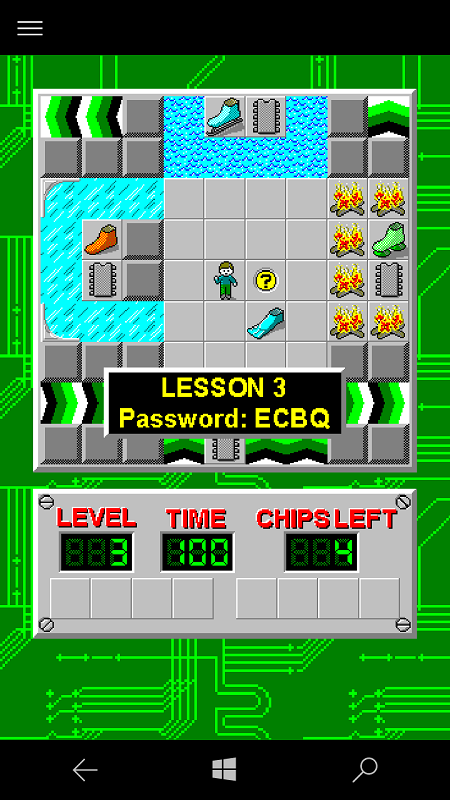

# ChipsChallenge-UWP
A Universal Windows Platform (UWP) implementation of the Microsoft version of Chips Challenge.

##Credits
- Initial game implementation by RAMPKORV ([https://github.com/RAMPKORV/Chips-Challenge-Java](https://github.com/RAMPKORV/Chips-Challenge-Java))
- Game engine converted to C# with "Java to C# Converter" by [http://www.tangiblesoftwaresolutions.com](http://www.tangiblesoftwaresolutions.com)
- Portrait mode layout by Iceboxman Technologies [http://www.iceboxman.com/software/pocketpc/chips.php](http://www.iceboxman.com/software/pocketpc/chips.php)
- Original Chip's Challenge developed by Chuck Sommerville 

## Supported Devices
- Windows 10
- Windows 10 Mobile
- Xbox One

## Screenshots
### Windows 10

### Windows 10 Mobile

